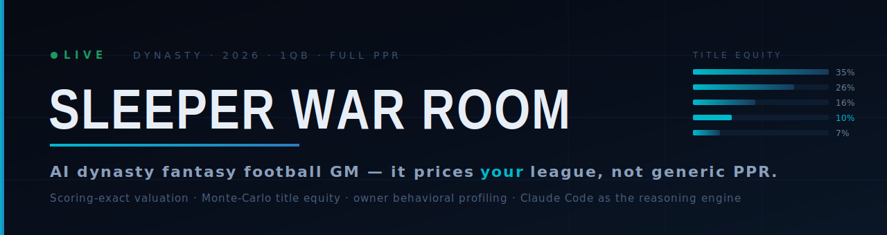
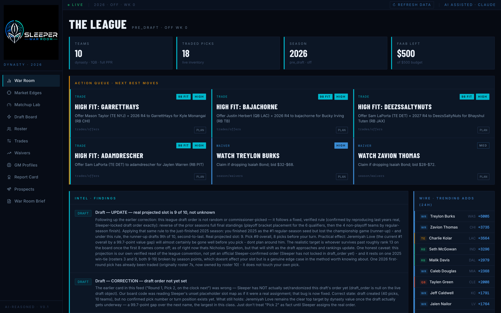
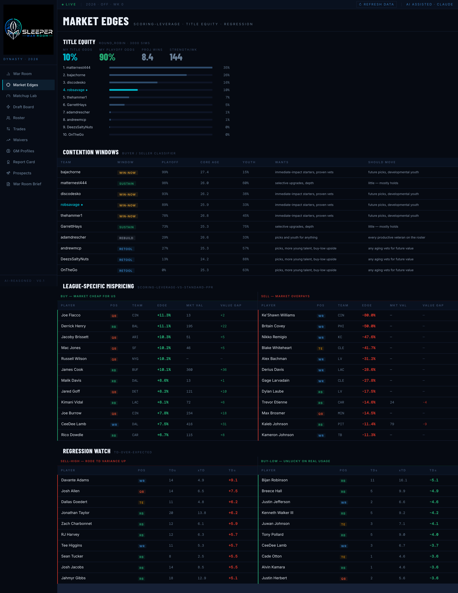
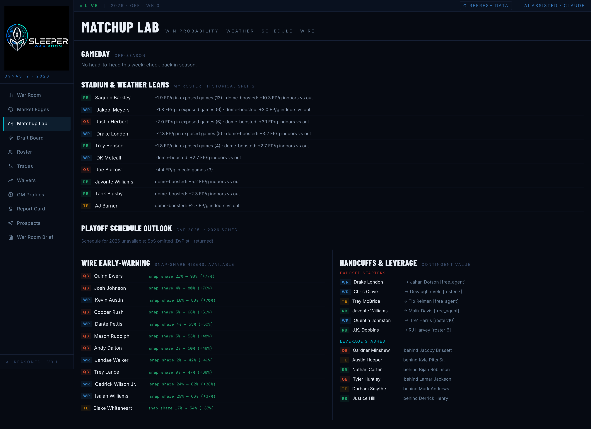
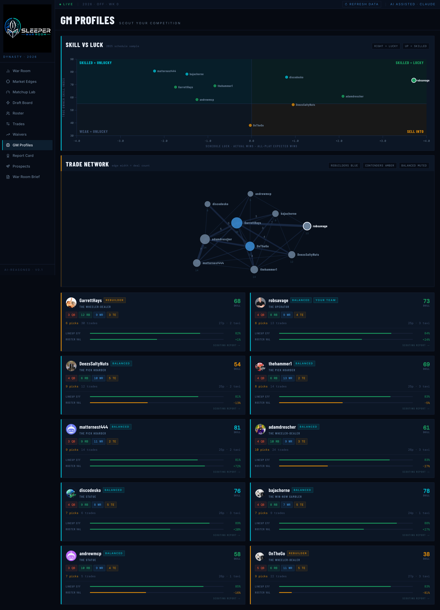
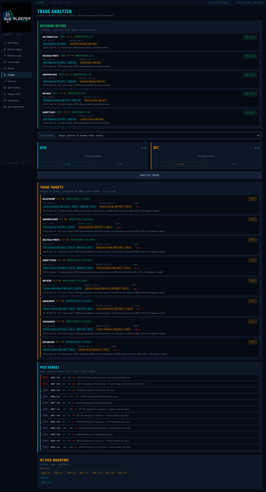

<p align="center">
  
</p>

<p align="center">
  <b>An AI general manager for one dynasty fantasy football league.</b><br/>
  <i>What is this player, pick, or trade worth to my team, under my league's exact scoring, this week?</i>
</p>

<p align="center">
  <a href="https://www.python.org/"></a>
  <a href="https://fastapi.tiangolo.com/"></a>
  <a href="https://pola.rs/"></a>
  <a href="frontend/"></a>
  <a href="frontend/"></a>
  <a href="tests/"></a>
  <a href="evals/"></a>
  <a href=".claude/skills/war-room-reason/SKILL.md"></a>
  <a href="LICENSE"></a>
</p>

---

## What it is

Most dynasty trade tools give a player one market value. That number is the same whether you're rebuilding or chasing a title this year, and the same whether your league runs standard PPR or something your commissioner customized. So it answers a question nobody actually has.

Sleeper War Room re-derives every valuation under one league's real scoring settings: full PPR with yardage and threshold bonuses, 1QB, no kicker, no DST. When that disagrees with the national market's generic-PPR price, the gap is an edge, and it's specific to this roster and this timeline.

Around the scoring core sits the rest of the app: a dynasty asset model that puts players, keepers, and three years of picks in one currency; a Monte-Carlo season simulator that turns roster strength into a championship probability; owner profiles learned from the league's real trade history; and Claude Code as the GM, reading the whole franchise state and posting back one strategic brief. There is no runtime LLM key in the backend. Deterministic engines build the prompt, Claude reasons, findings post back, the dashboard renders them.

It's read-only. It recommends, explains, and logs decisions; it never submits a Sleeper transaction. The recommendations are the product.

> **For evaluators:** the screenshots below are live application output. [The War Room](#the-war-room) is the product, [The edge](#the-edge--league-exact-scoring) is the thesis in three paragraphs, [AI engineering](#ai-engineering--claude-code-as-the-reasoning-engine) is the technical spine, and [Engine evaluation](#engine-evaluation--tuning-the-reasoning-loop-against-ground-truth) is how I keep it honest. Every surface is backed by a deterministic engine with tests.

---

## The War Room

> *The command center: read the situation, see the next moves, act on the brief.*

<p align="center">
  
</p>

The War Room opens on the franchise at a glance: league format, traded-pick inventory, FAAB. Then an **action queue** of the highest-leverage moves, each an engine-built, value-balanced trade or waiver with a FIT score and an urgency. Below that, the **intel feed** — the findings Claude Code has reasoned and posted back, in the analyst voice. The one shown here works out this league's actual draft-order convention (reverse of the prior season's final standings), catches an earlier bug in that logic, and recomputes the real projected slot. That's the reasoning layer showing its work against verified league facts.

---

## Market Edges

> *The trade brain: title equity, who's buying and selling, and where the market is wrong for this team.*

<p align="center">
  
</p>

Four engines on one page:

- **Title equity.** A Monte-Carlo season simulation ([`season_sim.py`](src/sleeper_ffm/model/season_sim.py)) ranks every roster by championship probability, so "contend or rebuild" is a number instead of a guess.
- **Contention windows.** Each rival is classified `WIN-NOW` / `SUSTAIN` / `RETOOL` / `REBUILD` from odds, core age, and youth share, along with what they want and what they should move. Aim trades at the fit.
- **League-specific mispricing.** Each player is scored twice — under our rules and under generic PPR — and the gap, normalized against his position, is the edge the national market doesn't price. On the board above, the BUY column skews to QBs and workhorse backs, which is what our passing and yardage bonuses reward more than standard PPR does: Joe Flacco +11.3%, Derrick Henry +11.1%, James Cook +10.1%.
- **Regression watch.** Touchdowns over expected flags sell-highs (Davante Adams was +9.1 TDs above his yardage) and buy-lows (Bijan Robinson, −5.1) before the market catches up.

---

## Matchup Lab

> *The lineup brain: win probability, weather and stadium history, playoff schedule, and the wire.*

<p align="center">
  
</p>

Five things before lineups lock. **Win probability** for the week's matchup, with the margin modeled as normal over both teams' projected scores. Each rostered player's **historical splits by venue and conditions** — dome vs. exposed, cold, wind, per-stadium (Derrick Henry runs +6.1 FP/game indoors). An opponent-adjusted **playoff strength-of-schedule**, weighted to fantasy weeks 15–17. A **wire feed** of snap-share risers still on the market. And a **handcuff map** of exposed backups and stashes sitting behind rivals' stars.

---

## GM Profiles & the rest of the app

> *The trade engine only works if you know who's on the other side.*

<table>
  <tr>
    <td width="50%"></td>
    <td width="50%"></td>
  </tr>
</table>

Every owner is profiled from the league's real transaction history: an archetype (pick hoarder, win-now star collector, and so on), an approachability read, trade-partner tendencies, and positional needs. That profile feeds the acceptance model behind every proposed offer and the **negotiation copilot**, which tailors a pitch to how that owner values assets. Twelve surfaces in all:

| Route | View |
|---|---|
| `/` | **War Room** — command center + AI intel findings |
| `/edges` | **Market Edges** — mispricing, title equity, contention, regression |
| `/matchups` | **Matchup Lab** — win probability, weather, SoS, wire, handcuffs |
| `/draft` | **Draft Board** — live board, value-based recs, standings-projected slot |
| `/roster` | **Roster** — dynasty values, age curve, lineup |
| `/trades` | **Trades** — acceptance-model offers with two-sided value accounting |
| `/waivers` | **Waivers** — claim cards, bid ranges, drop candidates, downside |
| `/owners` | **GM Profiles** — owner behavioral profiling |
| `/report-card` | **Report Card** — historical manager grades across seasons |
| `/prospects` | **Prospects** — rookie scouting (CFBD college + combine + market) |
| `/narrative` | **War Room Brief** — the single-prompt GM update |
| `/market-signals` | **Market Signals** — dynasty price-history trends and top risers/fallers |

---

## The edge — league-exact scoring

It comes down to one file: [`scoring/engine.py`](src/sleeper_ffm/scoring/engine.py). It turns a stat line into fantasy points under the league's real `scoring_settings`, with no hardcoded weights, so it stays correct when the commissioner changes a rule. It also derives the threshold bonuses the national market ignores: 100/200-yard, 300/400 pass-yard, 25-completion, 20-carry.

Because every valuation flows through that file, the app can score the same season twice — once under our rules, once under canonical PPR — and rank the players whose value diverges. That's [`model/mispricing.py`](src/sleeper_ffm/model/mispricing.py). The detail that keeps it honest is the position-median normalization: a uniform league-wide difference like 6-point vs. 4-point passing TDs cancels out, so what's left is the player-specific profile edge rather than the scoring level. The output is a buy/sell board in the same dynasty units as everything else.

Everything downstream runs through the same scoring: the [dynasty asset model](src/sleeper_ffm/model/dynasty.py) (age-curve-projected FPAR, players and picks in one currency), the [market blend](src/sleeper_ffm/market/blend.py) (market-anchored 65/35, since the market is cross-positionally sane and the model contributes a within-position ranking), and the [in-house sabermetrics](src/sleeper_ffm/model/sabermetrics.py) (consistency, TD dependence, usage quality, xFP).

---

## AI engineering — Claude Code as the reasoning engine

> *Deterministic engines build the prompt, the model reasons, findings post back, and the model is never the source of a fact.*

The LLM stays out of the backend. The loop is three steps:

1. **Deterministic engines build a structured briefing.** [`prompts/master.py`](src/sleeper_ffm/prompts/master.py) composes league state, roster, title equity, contention windows, mispricing, regression, handcuffs, wire, weather, and playoff SoS into one prompt. It's pure and testable — `build_master_briefing` takes a context and a timestamp, with no clock and no network.
2. **Claude Code reasons over the whole franchise.** The [`war-room-reason`](.claude/skills/war-room-reason/SKILL.md) skill fetches the briefing, reasons in a veteran-analyst voice, then drafts, critiques its own draft independently, fixes, and only then posts. A single unverified pass has produced real errors: invented trade partners, stale numbers restated as current. The critique step catches that before it reaches the dashboard.
3. **Findings post back as structured JSON.** The [findings store](src/sleeper_ffm/reasoning/findings.py) is the boundary, and the dashboard renders what's posted. Any fact not literally in the briefing — a partner name, a pick-class percentage — has to be fetched fresh from the API and cited, never recalled from memory.

The same pattern runs the [negotiation copilot](src/sleeper_ffm/prompts/negotiation.py) and the [GM's weekly address](src/sleeper_ffm/prompts/gm_address.py). It's retrieve-before-generate, structured output, and a self-critiquing agent, with grounding enforced at the file boundary instead of trusted to the model.

---

## Engine evaluation — tuning the reasoning loop against ground truth

> *A train/test split applied to the app's own decision logic: does the engine compute the right number, and does the reasoning layer actually use it?*

Two things a unit test can't check. Is a value-balanced trade offer good dynasty strategy for this team's timeline? And does the reasoning layer flag it when it isn't? The [`sffm eval`](src/sleeper_ffm/evals/) harness and its [Claude Code skill](.claude/skills/engine-eval/SKILL.md) answer both, and re-answer them every time an engine or the master-briefing prompt changes.

- **Tier 1 — 120 deterministic scenarios** (86 train / 34 holdout) across all seven tunable engines. Every scenario calls the real production function, not a reimplementation, with hand-built dependency-injected inputs. Every expected value came from running the actual engine, not from working it out by hand.
- **Tier 3 — six briefing fixtures with planted traps**, rendered through the real `build_master_briefing` template: a hallucinated trade partner, a stale-data acknowledgment, a closed player universe, and three cases where the math checks out but the strategy doesn't — a rebuild-window team trading a future pick for short-term production, a waiver priority score that ignores a real roster hole, a start/sit call that ignores a stated blowout risk. Schema validity, grounding, and FAAB bounds are scripted. A fresh, independent critic subagent judges whether a recommendation reconciles the math against the team's context, and I verified adversarially that the critic actually discriminates sound reasoning from unsound rather than rubber-stamping.

Running it against the real reasoning loop is how the trade-acceptance and waiver-priority fixes below turned up: the raw math balanced, the model flagged that it shouldn't have, and the engines didn't yet know why. Now they do.

---

## The data layer

Everything comes from public APIs and is cached to local parquet. Nothing here is a secret, and the heavy caches are gitignored.

| Source | Coverage | Role |
|---|---|---|
| **Sleeper API** | live league | rosters, matchups, transactions, trending, drafts, traded picks |
| **nflverse** weekly | 2014–2025 | per-player box scores — the scoring engine's primary input |
| **nflverse** snaps | 2014–2025 | opportunity trend + wire early-warning |
| **nflverse** schedules | + roof / temp / wind | defense-vs-position, strength of schedule, stadium & weather splits |
| **nflverse** depth charts | latest snapshot | handcuff / leverage map |
| **nflverse** injuries | current season | real-world intel feed |
| **FantasyCalc / DynastyProcess** | live | dynasty market anchor (player + pick values) |
| **CFBD** + combine | college | rookie prospect scouting |

The scoring engine ingests two weekly formats — the archived `player_stats` era (≤2023) and the current `stats_player` era (2024+) — and reconciles them on load, including a `diagonal_relaxed` concat so multi-season reads span the schema boundary cleanly.

---

## Under the hood

**Backend** — Python 3.12, FastAPI, Polars, `uv`, `ruff`, `pyright`. About 21K lines across **34 model engines** and **36 API routers**, with **265 tests**. The statistical cores are unit-tested without a network. On top of that sits the **120-scenario eval harness** ([Engine evaluation](#engine-evaluation--tuning-the-reasoning-loop-against-ground-truth) above) for the calibration checks unit tests can't cover. A `typer` CLI (`sffm <verb>`) drives ingestion, scoring, evaluation, and the war-room loop.

**Frontend** — React 19, TypeScript 6, Vite 8, Tailwind 4, TanStack Query, Zustand, Framer Motion. A single-page dashboard with 12 routes, wired to the live backend.

```
src/sleeper_ffm/
├── scoring/     # league-exact stat-line → fantasy points (the linchpin)
├── sleeper/     # read-only Sleeper API client + dynasty history walk
├── nflverse/    # historical stats ingestion (nfl-data-py → parquet)
├── cfbd/ college/ combine   # college + combine data for rookie scouting
├── model/       # 34 engines: valuation, dynasty assets, mispricing, season sim,
│                #   contention, regression, stadium/weather, schedule strength,
│                #   handcuffs, wire watch, gameday, vegas, opponent-adjusted,
│                #   faab market, owner dossiers, sabermetrics…
├── market/      # FantasyCalc / DynastyProcess anchor + model↔market blend + price history
├── prompts/     # deterministic prompt-builders (master briefing, negotiation, address)
├── reasoning/   # the findings store Claude Code writes back to
├── season/ draft/ act/ schedule/   # start-sit, waivers, draft assistant, plans, scheduler
├── evals/       # sffm eval harness: 120 scenarios (Tier 1) + prompt-grading fixtures (Tier 3)
└── api/         # FastAPI app + 36 routers
frontend/        # React 19 / Vite 8 / Tailwind 4 dashboard (12 routes)
evals/           # scenario JSON (train/holdout), tier-3 rubric, run ledger
.claude/         # the war-room-reason + engine-eval skills + launch config — the agent loop
```

---

## Local setup

```bash
# Backend
uv sync
uv run pytest                 # 265 tests
uv run sffm eval run --tier 1 --split train   # 86 deterministic calibration scenarios
uv run sffm ingest            # seed nflverse parquet (2014–2025) → data/nflverse/
uv run sffm serve             # FastAPI on http://127.0.0.1:8000

# Frontend (proxies /api → backend)
cd frontend && npm install
npm run dev                   # → http://localhost:5173
```

Quick CLI sanity checks — no server needed:

```bash
uv run sffm league                                       # verified live league facts
uv run sffm score-line --rec 8 --rec-yd 120 --rec-td 1   # a stat line under our rules
uv run sffm roster                                       # dynasty values for my roster
```

The AI loop: with the server up, run the `/war-room-reason` skill in Claude Code (it fetches `GET /ai/briefing`, reasons, and posts one verified findings document back), then open the dashboard.

---

## How to read this repo

This is a personal project — an end-to-end build of scoring-aware valuation, simulation, and agentic product design, not a tool packaged for others to run. The screenshots and engines are the artifact.

- **10 min** — this README. The screenshots are live output, and [The edge](#the-edge--league-exact-scoring) is the thesis in three paragraphs.
- **30 min** — read [`scoring/engine.py`](src/sleeper_ffm/scoring/engine.py) and [`model/mispricing.py`](src/sleeper_ffm/model/mispricing.py), then [`prompts/master.py`](src/sleeper_ffm/prompts/master.py) and [`.claude/skills/war-room-reason/SKILL.md`](.claude/skills/war-room-reason/SKILL.md) for the agent loop.
- **An afternoon** — `uv sync && uv run sffm ingest && uv run sffm serve`, start the frontend, and open `/edges` and `/matchups`. Every board is backed by an engine with tests. Then run `uv run sffm eval run --tier 1 --split train` and read [`.claude/skills/engine-eval/SKILL.md`](.claude/skills/engine-eval/SKILL.md), the harness that keeps those engines and the reasoning loop calibrated against ground truth.

See [`CHANGELOG.md`](CHANGELOG.md) for the build history.

---

## License

This repository is **source-available** for evaluation, research, and education. Viewing and reading are permitted; copying, redistribution, commercial use, and ML-training on the source are not, without prior written permission. See [`LICENSE`](LICENSE). For commercial licensing or questions: **rob.savage@me.com**.

---

*Built end to end: data engineering, scoring-exact valuation, Monte-Carlo simulation, and an agentic reasoning loop. The point is to show how a front office would actually use AI — to sharpen decisions, with the model grounded and its work checked, never as the source of a fact.*
